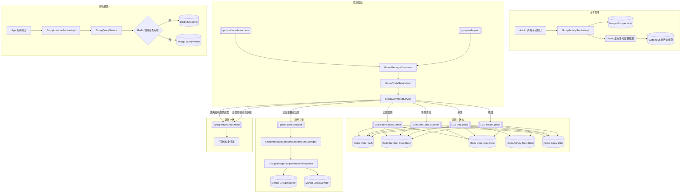
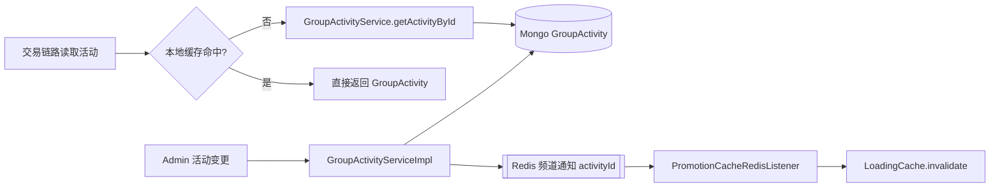
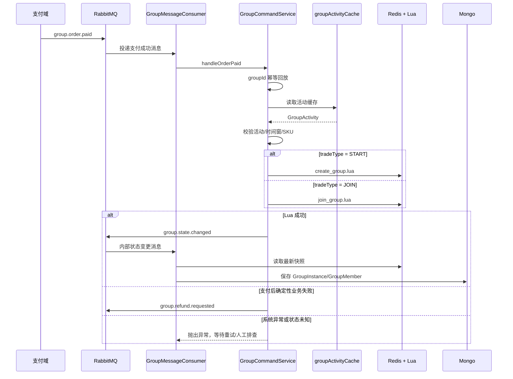
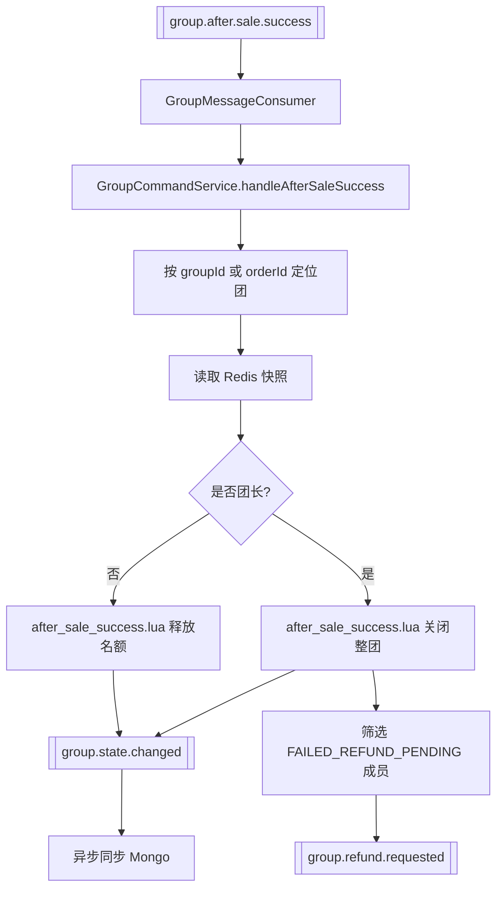
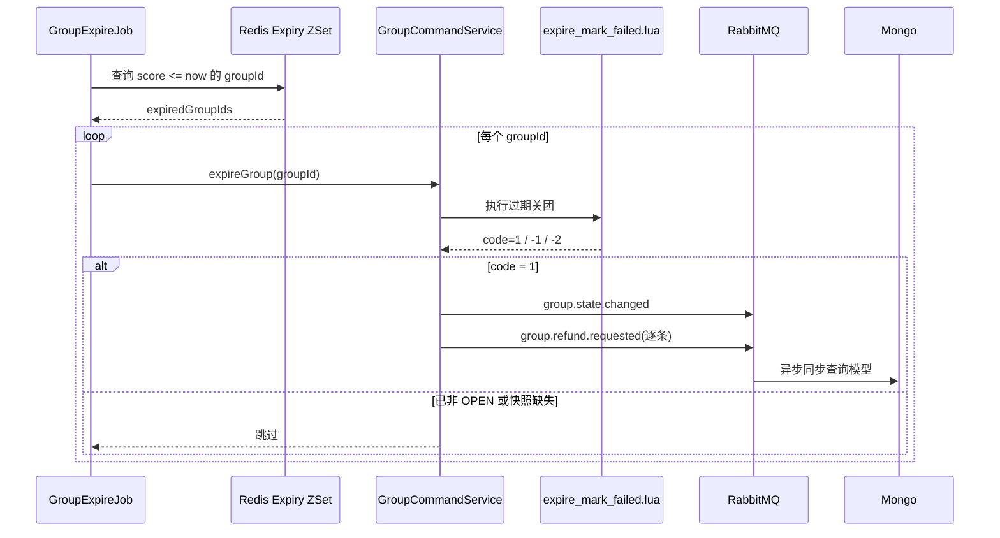
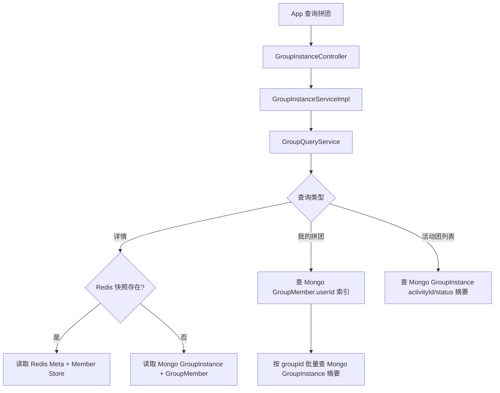
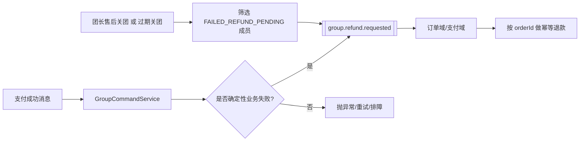

# ww-promotion 拼团业务走读与流程图

## 1. 模块定位

`ww-promotion` 当前实现的是“Redis 主状态 + Lua 原子迁移 + Mongo 查询投影”的拼团域。

核心设计取向如下：

- Redis 保存拼团运行时主状态，所有开团、参团、售后、过期都先改 Redis。
- Lua 负责把同一条命令中的状态迁移、索引更新、人数变更做成原子操作。
- Mongo 不承担交易主状态，只承担查询模型。
- RabbitMQ 在这里主要承担两类职责：
  - 驱动拼团交易状态机，例如 `group.order.paid`、`group.after.sale.success`
  - 驱动拼团域内异步落库，例如 `group.state.changed`
- 活动模板 `GroupActivity` 放在 Mongo，运行时通过 Caffeine 本地缓存加速读取。
- 退款执行不在拼团域内完成，拼团域只在确定性失败时发 `group.refund.requested` 补偿消息。

## 2. 核心对象

### 2.1 活动模板

- `GroupActivity`
- 以 `SPU` 维度定义拼团活动。
- `skuRules` 承载多 SKU 成交规则。
- `status` 不落库，按 `startTime/endTime` 动态计算。

### 2.2 团运行时状态

- Redis 主状态：
  - `group:instance:meta:{groupId}`
  - `group:instance:member-store:{groupId}`
  - `group:instance:user-index:{groupId}`
  - `group:activity:stats:{activityId}`
  - `group:expiry`
- Mongo 查询模型：
  - `GroupInstance`
  - `GroupMember`

### 2.3 状态

#### 团状态

- `OPEN`：进行中
- `SUCCESS`：满团成功
- `FAILED`：过期失败或团长售后关闭

#### 成员状态

- `JOINED`：支付成功并已占位
- `SUCCESS`：团成功
- `AFTER_SALE_RELEASED`：普通成员售后成功，已释放名额
- `FAILED_REFUND_PENDING`：团失败后待退款
- `LEADER_AFTER_SALE_CLOSED`：团长售后导致团关闭

## 3. 总体业务流程图

## 4. 活动管理流程

### 4.1 创建/更新活动

1. `GroupActivityController` 接收 B 端请求。
2. `GroupActivityServiceImpl` 校验时间窗、成团人数、活动有效期和 SKU 规则。
3. 服务层把 `GroupActivityBO` 转成 `GroupActivity`：
   - 新格式优先使用 `skuRules`
   - 兼容旧格式 `skuId/groupPrice/originalPrice`
   - 自动挑一条启用中的最低价 SKU 作为兼容展示字段
4. 活动存入 Mongo。
5. 读取 Redis 中的活动统计并回填 `openGroupCount/joinMemberCount`。
6. 更新或启用/禁用活动时，通过 Redis 频道广播活动 ID。
7. `PromotionCacheRedisListener` 收到频道消息后失效本地活动缓存。

### 4.2 活动缓存流程图

## 5. 开团与参团流程

### 5.1 开团

1. 上游支付域发送 `group.order.paid`，`tradeType=START`。
2. `GroupMessageConsumer` 收到消息后交给 `GroupTradeServiceImpl`。
3. `GroupCommandService.handleOrderPaid` 将消息翻译为 `CreateGroupCommand`。
4. 直接按上游透传的 `groupId` 做幂等回放。
5. 加载活动缓存并校验：
   - 活动存在
   - 活动启用
   - 活动已开始且未结束
   - `requiredSize/expireHours` 合法
   - `skuId` 在可售规则内
6. 计算 `businessExpireTime = min(现在 + expireHours, 活动结束时间)`。
7. 调用 `create_group.lua`：
   - 写团主状态
   - 写成员快照
   - 写团内活跃用户索引
   - 增加活动统计
   - 加入过期索引
8. 成功后发送 `group.state.changed`。
9. 消费内部消息，按 Redis 快照同步 Mongo。
10. 查询详情时优先读 Redis，返回最新状态。

### 5.2 参团

1. 上游支付域发送 `group.order.paid`，`tradeType=JOIN`。
2. `GroupCommandService` 翻译成 `JoinGroupCommand`。
3. 先按 `groupId + 团内 orderId` 做幂等回放。
4. 读取 Redis 团快照，拿到 `activityId`。
5. 加载活动并校验 SKU 规则。
6. 调用 `join_group.lua`：
   - 校验团是否存在
   - 校验团状态必须为 `OPEN`
   - 校验未业务过期
   - 校验用户未在团内占位
   - 校验剩余名额大于 0
   - 成功则写成员、索引和人数
   - 若人数满员则将团升级为 `SUCCESS`，并把所有 `JOINED` 成员改成 `SUCCESS`
7. 成功后发送 `group.state.changed`。
8. 内部消费者落库到 Mongo。

### 5.3 开团/参团流程图

## 6. 售后成功流程

### 6.1 普通成员售后

1. 上游发送 `group.after.sale.success`。
2. 拼团域直接按上游透传的 `groupId` 定位所属团。
3. 读取 Redis 团快照，定位当前订单对应成员。
4. 若当前成员不是团长，则执行 `after_sale_success.lua`：
   - 写入 `afterSaleId`
   - 更新最新轨迹为 `AFTER_SALE_SUCCESS`
   - 若团仍为 `OPEN`，把该成员改为 `AFTER_SALE_RELEASED`
   - 删除团内活跃用户索引
   - `currentSize - 1`
   - `remainingSlots + 1`
5. 发送 `group.state.changed`，异步更新 Mongo。
6. 该路径不触发拼团退款消息，因为售后域本身已经承担退款。

### 6.2 团长售后

1. 同样先定位团和成员。
2. 若售后的是团长，并且团仍为 `OPEN`，Lua 会：
   - 将团主状态改为 `FAILED`
   - 团长成员状态改成 `LEADER_AFTER_SALE_CLOSED`
   - 其他仍占位成员改成 `FAILED_REFUND_PENDING`
   - 清空团内活跃用户索引
   - 移除过期索引
   - 重置终态 TTL
3. 拼团域发送 `group.state.changed`。
4. 拼团域继续扫描 Redis 快照中的 `FAILED_REFUND_PENDING` 成员，并逐条发 `group.refund.requested`。

### 6.3 售后流程图

## 7. 过期关团流程

1. `GroupExpireJob` 按当前时间扫描 Redis `group:expiry`。
2. 逐个调用 `GroupCommandService.expireGroup`。
3. `expire_mark_failed.lua` 只处理仍处于 `OPEN` 且已过 `expireTime` 的团。
4. Lua 会：
   - 将仍为 `JOINED/SUCCESS` 的成员置为 `FAILED_REFUND_PENDING`
   - 清理活跃用户索引
   - 团状态置为 `FAILED`
   - 写 `failedTime/failReason`
   - 移除过期索引
   - 终态 TTL 重置为两天
5. 主链路发送 `group.state.changed`。
6. 拼团域逐条发 `group.refund.requested` 给待退款成员。
7. 内部消费者把 Redis 快照同步到 Mongo。

### 7.1 过期流程图

## 8. 查询流程

### 8.1 详情查询

1. App 调用 `GroupInstanceController`。
2. `GroupInstanceServiceImpl` 转给 `GroupQueryService`。
3. `GroupQueryService` 优先读 Redis 快照。
4. 若 Redis 存在，则直接组装 `GroupInstanceVO` 返回。
5. 若 Redis 不存在，则退化到 Mongo：
   - 读 `GroupInstance`
   - 读 `GroupMember`
   - 组装 VO

### 8.2 我的拼团 / 活动团列表

- “我的拼团”直接查 Mongo `GroupMember` 的用户维度索引，再批量回查 `GroupInstance` 摘要。
- “活动下的拼团列表”直接查 Mongo `GroupInstance` 摘要。
- 这两类列表都不直接扫 Redis，避免在列表场景对 Redis 做重查询。

### 8.3 查询流程图

## 9. 退款补偿流程

### 9.1 触发时机

拼团域只在以下场景发退款申请消息：

- 支付成功后，开团/参团被确定性业务规则拒绝
  - 活动未开始
  - 活动已结束
  - 活动已禁用
  - SKU 不在活动范围
  - 团已满
  - 团已关闭
  - 用户已在团中
- 团最终失败后，成员状态为 `FAILED_REFUND_PENDING`

### 9.2 不触发时机

- 系统异常、Redis 异常、状态未知
- 普通成员售后成功释放名额

### 9.3 退款补偿流程图

## 10. 关键实现约束

### 10.1 幂等

- 支付成功链路以“上游透传 `groupId` + 团内 `orderId`”做幂等。
- 成员 Mongo 投影以 `orderId` 做增量 upsert。
- 退款补偿消息设计成由下游按 `orderId + refundScene` 或业务退款单号继续做幂等。

### 10.2 原子性

- Redis 状态迁移全部通过 Lua 完成。
- 多实例并发下，不依赖 JVM 内锁。
- 过期任务和售后处理都依赖 Redis Lua 保证最终状态一致。

### 10.3 查询一致性

- 详情查询优先 Redis，保证看到更实时状态。
- 列表查询优先 Mongo，保证成本稳定。
- `group.state.changed` 发送失败时，命令服务会本地兜底执行一次 `syncProjection`。

## 11. 走读结论

当前拼团域已经形成了比较清晰的分层：

- 活动模板管理：Mongo + 本地缓存
- 交易状态机：MQ 驱动 + Redis Lua 原子迁移
- 查询模型：Mongo 投影
- 定时补偿：过期关团任务
- 退款补偿：拼团域发消息，下游执行退款

如果后续继续演进，最适合补强的点有两个：

- 新增退款结果回流，把成员从 `FAILED_REFUND_PENDING` 再推进到“已退款”
- 为 `group.refund.requested` 增加独立消费者文档和时序图，形成跨域闭环说明
